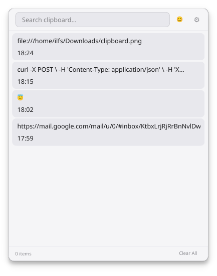
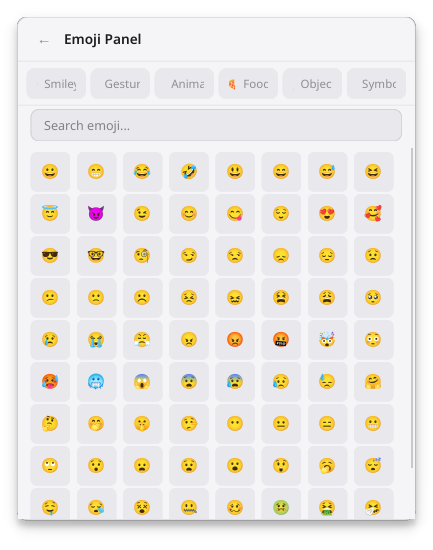

# Clipser

Lightweight clipboard manager for Windows. Minimal, fast, stays out of your way.






## Features

- **Win+V** global hotkey to show/hide the popup
- **System tray** — runs silently in the background
- **Persistent history** — SQLite-backed, survives reboots
- **Pin entries** (max 5) — pinned clips stay at the top
- **Click to copy** — clicking any entry copies it and moves it to the top
- **Search / filter** — type to find clips instantly
- **Emoji panel** — 370+ emojis across 6 categories with search
- **Dark & Light themes** — toggle in Settings
- **Auto-start** — optional launch with Windows
- **Configurable** — max history entries, timestamp visibility

## Requirements

- Python 3.10+
- Windows (primary target), Linux (secondary)

## Quick Start

```bash
# Clone or copy the project
cd clipser

# Install dependencies
pip install -r requirements.txt

# Run
python main.py
```

On Linux the global hotkey requires root (`sudo`). The app still works fully from the system tray icon.

## Settings

| Setting | Default | Description |
|---------|---------|-------------|
| Launch at startup | off | Adds shortcut to Startup folder (Windows) or autostart entry (Linux) |
| Theme | Dark | Dark or Light |
| Show timestamps | on | Show time next to each clip |
| Max entries | 200 | 10–2000, oldest clips pruned first |

## Build (Windows EXE)

```bash
pip install pyinstaller

pyinstaller ^
    --onefile ^
    --windowed ^
    --name Clipser ^
    --icon media/clipser.png ^
    --add-data "resources:resources" ^
    --add-data "media:media" ^
    --hidden-import keyboard ^
    --hidden-import keyboard._winkeyboard ^
    --hidden-import keyboard._keyboard_event ^
    --exclude-module PySide6.QtQml ^
    --exclude-module PySide6.QtQuick ^
    --exclude-module PySide6.QtQuickWidgets ^
    --exclude-module PySide6.QtWebEngine ^
    --exclude-module PySide6.QtWebEngineCore ^
    --exclude-module PySide6.QtWebChannel ^
    --exclude-module PySide6.QtSvg ^
    --exclude-module PySide6.QtSvgWidgets ^
    --exclude-module PySide6.QtPrintSupport ^
    --exclude-module PySide6.QtOpenGL ^
    --exclude-module PySide6.QtOpenGLWidgets ^
    --exclude-module PySide6.QtSql ^
    --exclude-module PySide6.QtTest ^
    --exclude-module PySide6.QtXml ^
    --exclude-module PySide6.QtNetwork ^
    main.py
```

The `.exe` lands in `dist/Clipser.exe`.

### Shrinking the binary

| Method | Saving | Notes |
|--------|--------|-------|
| **UPX** (install separately) | ~40-50% | `pip install upx`, PyInstaller uses it automatically if found on PATH. Can trigger antivirus false positives — test before distributing. |
| `--exclude-module` | ~5-10 MB | Strips unused Qt modules (Qml, WebEngine, Svg, etc). Already included above. |
| `--strip` | ~1-2 MB | Removes debug symbols from the bundled Python library. |
| Clean venv | ~10-20 MB | Only install what's in `requirements.txt`, no extra packages. |
| `--onedir` | N/A | Produces a folder (larger on disk, faster startup). Use `--onefile` for single exe. |

**Max-shrink one-liner (PowerShell):**

```powershell
pyinstaller --onefile --windowed --strip --name Clipser --icon media/clipser.png --add-data "resources:resources" --add-data "media:media" --hidden-import keyboard --hidden-import keyboard._winkeyboard --hidden-import keyboard._keyboard_event --exclude-module PySide6.QtQml --exclude-module PySide6.QtQuick --exclude-module PySide6.QtQuickWidgets --exclude-module PySide6.QtWebEngine --exclude-module PySide6.QtWebEngineCore --exclude-module PySide6.QtWebChannel --exclude-module PySide6.QtSvg --exclude-module PySide6.QtSvgWidgets --exclude-module PySide6.QtPrintSupport --exclude-module PySide6.QtOpenGL --exclude-module PySide6.QtOpenGLWidgets --exclude-module PySide6.QtSql --exclude-module PySide6.QtTest --exclude-module PySide6.QtXml --exclude-module PySide6.QtNetwork main.py
```

Typical results: ~70 MB raw → ~35 MB with UPX → ~25 MB with exclusions + UPX.

## License

MIT
